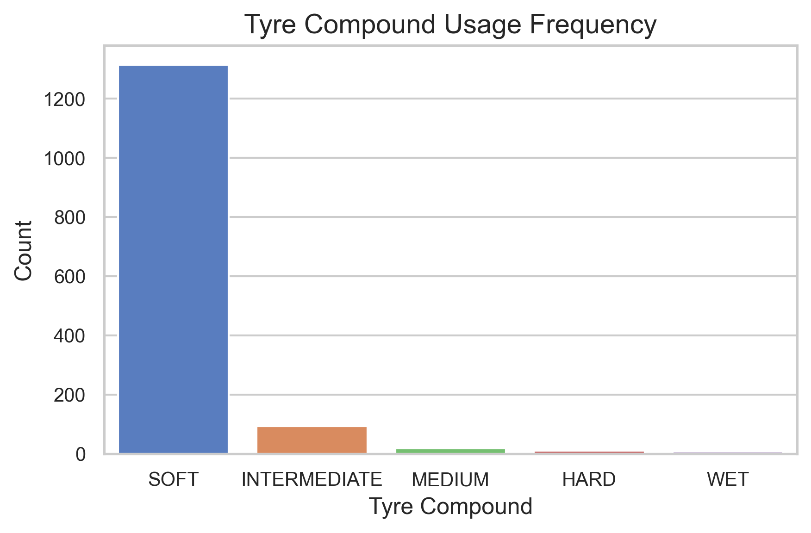
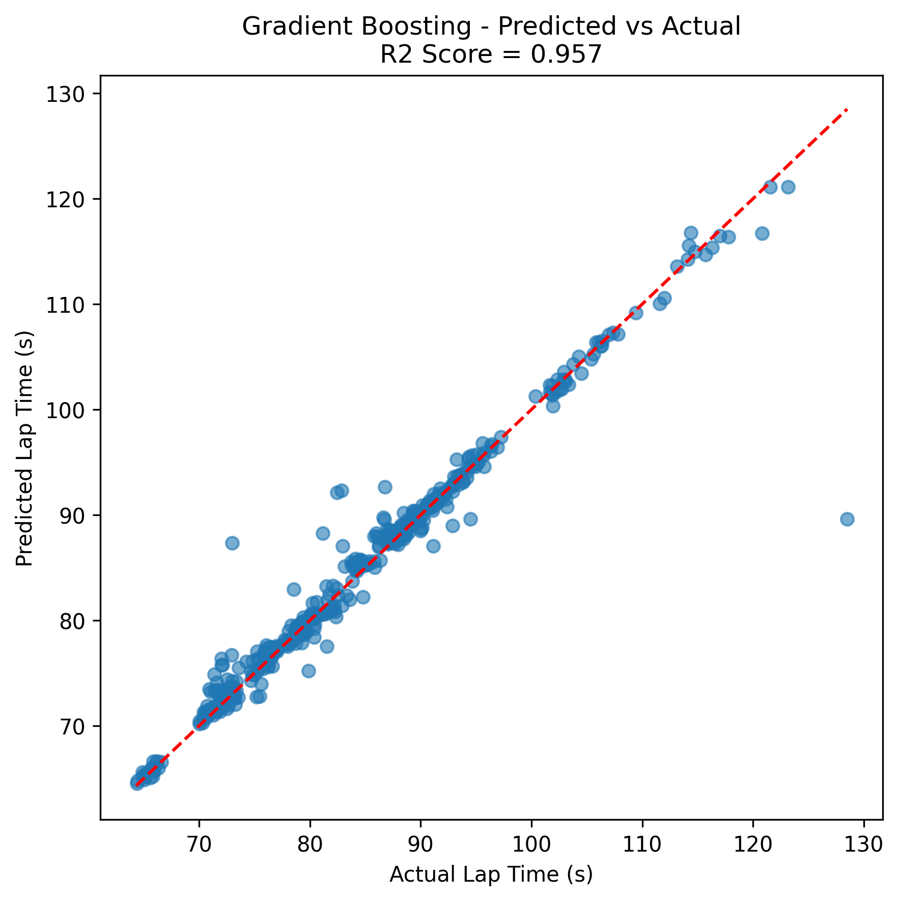
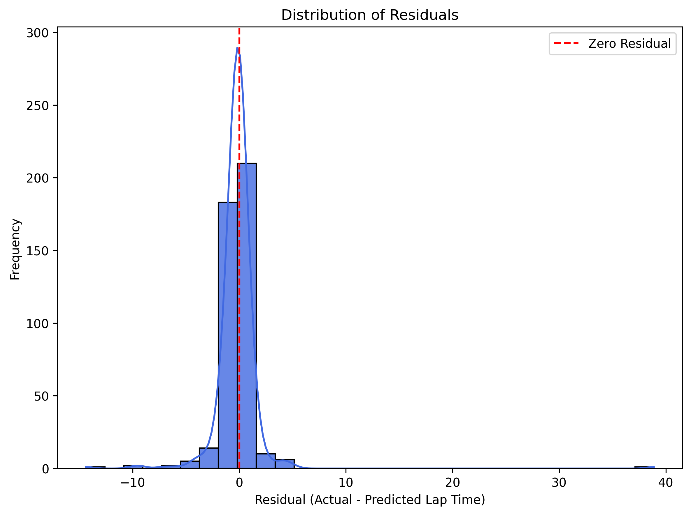
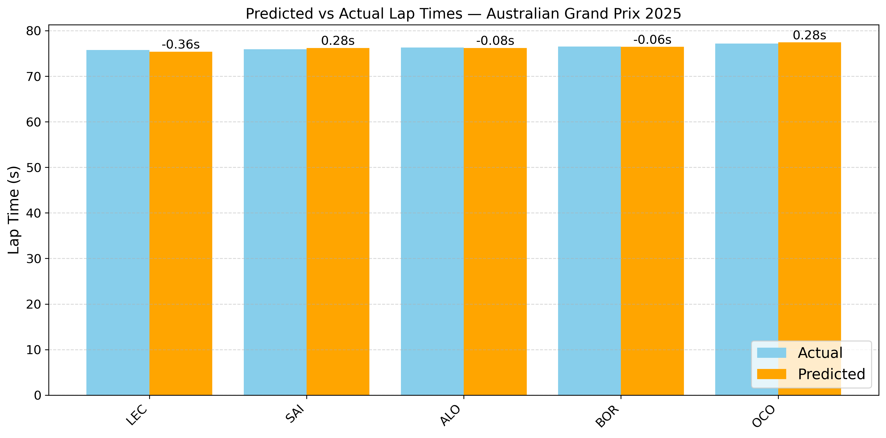
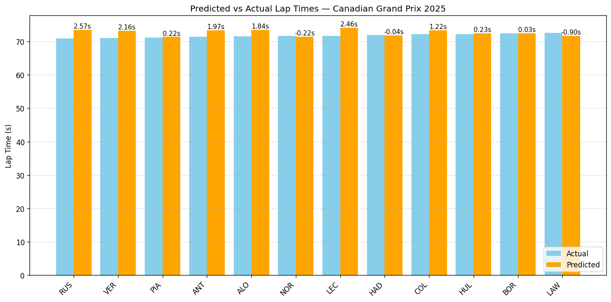
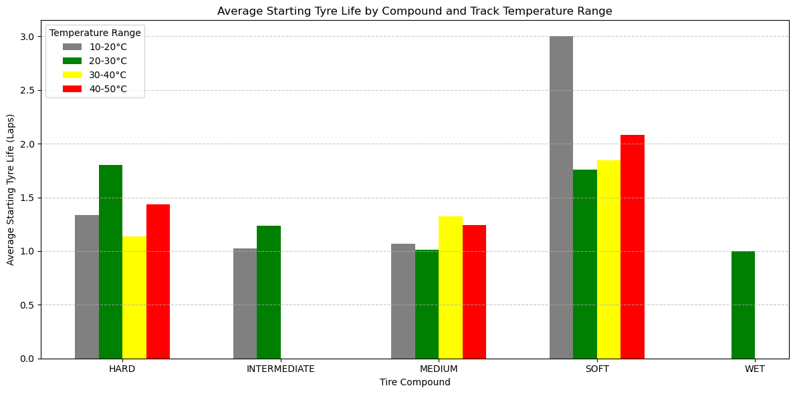
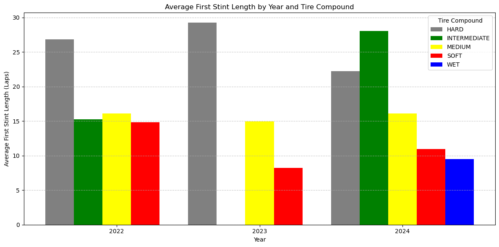
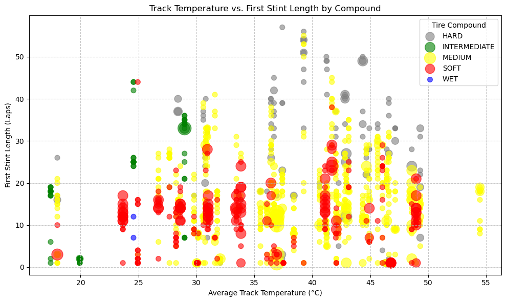
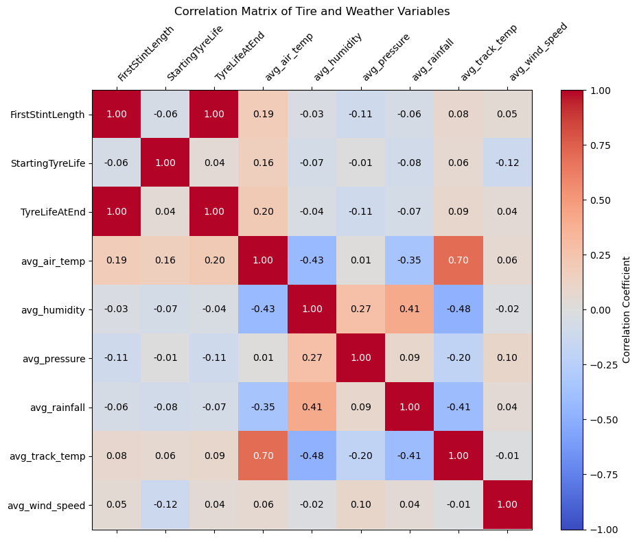

<h1 align="center">Formula 1 Race Predictor</h1>

<h2 align="center">Midterm Checkpoint</h2>

<h3 align="center">CS 7641 – Summer 2025 – Group 4</h3>

---

## Introduction / Background

Formula 1 is the most popular motorsport in the world, attracting millions of viewers and offering large prize pools. As such, identifying competitive advantages and predicting performance are vital for influencing race outcomes. Brusik [1] compares a wide range of univariate time-forecasting models along with more complex multivariate deep learning techniques to predict race time, demonstrating that multivariate models perform more accurately. Haber et al. [2] dives into these numerous factors to predict race winners, using Random Forests with SHAP analysis to identify key features. Finally, Menon et al. [3] uses Monte Carlo analysis to predict outcomes and determine how variance in race results can be explained.

A few datasets will be combined for analysis. **[FastF1](https://docs.fastf1.dev/)** is a python package for accessing and analyzing Formula 1 results, schedules, timing data, and telemetry. **[TUMFTM Racetrack Database](https://github.com/TUMFTM/racetrack-database)** is a repository consisting of centerlines, track widths and race lines for F1 racetracks. Finally, **[Tomo Bacinger’s F1 Circuit Data](https://github.com/bacinger/f1-circuits)** is a repository of F1 circuits data in GeoJSON format. We will pull data and generate features from these sources.

---

## Problem Definition and Motivation

Formula 1 is a data-dependent sport where success is dictated by a combination of driver skills, engineering, track conditions, and strategy. Each race results from multiple interdependent variables, making it an ideal candidate for machine learning-based predictions.

The motivation behind developing such predictive tools is threefold:

### Race Strategy Simulation

Decisions like when to pit, whether to undercut a competitor, or how aggressively to push a tire compound are made in real time under intense pressure. A robust prediction framework trained on historical data can serve as a surrogate for simulating race scenarios.

### Sports Analytics and Research

F1 presents a unique challenge: it is a small-data, high-complexity environment with structured multivariate data heavily dependent on time and has non-stationary patterns due to rule changes, car upgrades, and track changes. Developing effective predictive models enables exploration of critical research topics such as:

- Multimodal feature integration

- Time-series forecasting in sparse regimes

- Interpretable model design in real-world systems

### Fan and Betting Communities

Publicly available predictions are often heuristic-based or overly simplistic. We seek to make accurate, data-driven predictions accessible and interpretable to the wider F1 audience.

---

## Methods

<h3 style="text-align: center;">Tire Choice Modeling</h3>

#### Data Proprecessing

The data was downloaded via the FastF1 database. The main preprocessing technique in the current work is data reduction via feature selection. For regression analysis of predicting lap time improvement by switching tires, the chosen features are reduced to Air Temperature, Track Temperature, Humidity, Pressure, Rainfall (T/F), Wind Direction, and Wind Speed. The chosen model, XGBoost, is generally pretty resiliant to poorly transformed data since it is tree based, but there is certainly room for future work to help aid the convergence of these models.

#### ML Algorithms/Models Implemented

The chosen model for the classification and regression problems was XGBoost. It was chosen because it is a well performing tree based model for both of these problems, which performs very well at scale and can be easily tuned to prevent overfitting. It's a great starting point due to it's simplicity, but simpler models shall be evaluated for the final report. Additionally, unsupervised models such as clustering will be implemented on this problem in the final report to see if there are groupings between weather conditions that may reveal trends in tire selection, before looking at lap time improvements.

<h3 style="text-align: center;">Best Qualifying Lap Predictor</h3>

#### Data Preprocessing

To predict the best qualifying lap times for each driver across a race weekend, data from all Formula 1 races between the 2022 and 2025 seasons was collected using the FastF1 API.

A range of features influencing qualifying lap times was selected, including:

- Event Metadata: Year, Round, Circuit Type

- Driver-Specific Factors: Driver, Team, Tyre Compound, Tyre Life, Fresh Tyre status

- Weather Conditions: Air Temperature, Humidity, Pressure, Rainfall, Wind Speed, Wind Direction

- Performance Metrics:

- Sector 1, 2, and 3 times

- Free Practice 2 (FP2) lap times

- FP2 gap to the session-best lap

Feature engineering:

- Categorical features (e.g., Driver, Team, Tyre Compound) were encoded using One-Hot Encoding.

- Numerical features (e.g., Weather values, Tyre Life, Sector Times) were standardized using z-score normalization.

- Team name inconsistencies due to rebranding across seasons (e.g., Alfa Romeo → Stake) were resolved for uniformity.

#### ML Algorithms/Models Implemented

To model the qualifying lap times as a regression problem, four machine learning algorithms were implemented: Linear Regression, Ridge Regression, Random Forest Regression, and Gradient Boosting Regression. Furthermore, to ensure the models generalize well and avoid overfitting, 5-fold cross-validation was used through GridSearchCV for hyperparameter tuning and performance evaluation.

<h3 style="text-align: center;">Track Clustering and Analysis</h3>

#### Data Preprocessing

The initial data was sourced from **[Tomo Bacinger’s F1 Circuit Data](https://github.com/bacinger/f1-circuits)** which consists of GeoJSON files containing geographical information about various F1 circuits. The preprocessing pipeline was designed to extract relevant features for clustering, which varied depending on the chosen model.

* For simpler models, basic circuit properties like **track length** and **altitude** were extracted directly from the file's properties section. Any circuits with missing values for these features were dropped.

For more advanced analysis, a feature engineering pipeline was developed to quantify the characteristics of each track's layout from its raw coordinate data.

* **Coordinate Transformation**: The raw latitude and longitude coordinates for each track were converted into Cartesian coordinates (x, y) in meters. This was achieved by using the mean latitude of the track to establish a reference for converting degrees of longitude and latitude into an approximate distance in meters.

* **Curvature Calculation**: To understand the cornering characteristics, the curvature at each point along the track was calculated using the formula:

where x', y', x'', and y'' are the first and second derivatives of the track's coordinates with respect to the path length. These derivatives were computed numerically using `np.gradient`.

* **Engineered Features**: From the geometric data, four key performance metrics were engineered for each track:

* `percent_straights`: The percentage of the track where the absolute curvature is below a defined low threshold (0.002), representing straight sections.

* `avg_abs_curvature`: The average of the absolute curvature values across the entire track, indicating the overall intensity of the corners.

* `num_corners`: The number of distinct corners, counted by identifying segments where the absolute curvature surpasses a corner-defining threshold (0.015).

* `std_curvature`: The standard deviation of curvature, which serves as a proxy for how varied the track is, distinguishing between "stop-and-go" tracks (high variance) and "flowing" tracks (low variance).

To ensure that features with different units and scales did not disproportionately influence the clustering algorithms, the `StandardScaler` from scikit-learn was applied to the engineered feature set before feeding it into the Gaussian Mixture Models.

#### ML Algorithms/Models Implemented

Two distinct unsupervised clustering algorithms were implemented to categorize the tracks based on the processed features.

**DBSCAN (Density-Based Spatial Clustering of Applications with Noise)**

DBSCAN was used for an initial, simple clustering based on density.

* **Implementation**: The model was applied to the basic `length` and `altitude` features.

* **Parameters**: The algorithm was configured with `eps=200` and `min_samples=2`.

* **Noise Handling**: A key feature of this implementation is the custom treatment of noise points. Instead of leaving outlier tracks with the default `-1` label, a function (`cluster_and_treat_noise_as_clusters`) was created to assign each noise point its own unique cluster ID. This ensures every track is assigned to a group, treating isolated tracks as unique, single-member clusters.

**Gaussian Mixture Models (GMM)**

GMM was chosen for its ability to perform "soft" or probabilistic clustering, providing a more nuanced classification of the tracks. This model was applied in three different ways:

1. **GMM on Basic Properties**: A GMM with `n_components=9` was fitted to the scaled `length` and `altitude` features. This served as a baseline to see how a probabilistic model would group tracks based on simple physical stats.

2. **Binary Classification (2 Clusters)**: A GMM with `n_components=2` was applied to the four engineered geometric features (`percent_straights`, `avg_abs_curvature`, etc.). The resulting two clusters were interpreted as **"High Speed"** vs. **"Low Speed"** by identifying the cluster with the higher average `percent_straights`. The model also provided the probability of each track belonging to the "High Speed" cluster, allowing for a ranked classification.

3. **Archetype Classification (4 Clusters)**: To create a more detailed classification, a GMM with `n_components=4` was fitted to the same engineered features. The resulting four clusters were assigned archetypes by analyzing their mean feature values. A classification scheme was developed based on whether a cluster's average `percent_straights` and `std_curvature` were above or below the dataset's median values, resulting in four distinct categories:

* **High Speed - Flowing**

* **High Speed - Stop-and-Go**

* **Low Speed - Flowing**

* **Low Speed - Stop-and-Go**

<h3 style="text-align: center;">Tire Stint and Pitstop Predictor</h3>

#### Data Preprocessing

We use the FastF1 database to get lap-by-lap and weather data for the 2022-2025 seasons. We extract compound type, tire life, tire stint, avg. rainfall, avg. pressure, avg. wind direction, avg. windspeed and avg. track temperature. We use one-hot encoding to convert categorial data (compound type) into a numerical format.

#### ML Algorithms/Models Implemented

The project implements three machine learning models to predict Formula 1 first stint lengths. Linear Regression is used as a simple, interpretable baseline to identify basic trends in data, though it may miss complex patterns. Random Forest is an ensemble method that captures non-linear relationships and feature interactions. XGBoost is gradient boosting algorithm that can model complex relationships between features. Our goal here is predict tire wear, based on the track charecteristics and position-based information (not implemented yet).

## Results and Discussion

<h3 style="text-align: center;">Tire Choice Modeling</h3>

#### Visualizations

These visualizations show some of the results of the initial model training and prediction errors. Notably, it shows some of the initial hyperparameter tuning

and distribution of the residuals. This looks promising as a start but there is room for future improvement, discussed later.

#### Quantitative Metrics

| Model | MSE |

|:------------------:|:---------:|

| XGBoost | 0.04877 |

#### Analysis of Model

The first figure of the XGBoost Model Hyper-Parameter sweep shows the impact of the tree depth to the overfitting of the model, which seems to be around 4 levels. Looking at the relationship between actual value and residual, there seems to be a negative correlation, which suggests some amount of systematic error between the model and the data.

#### Next Steps

There are a few next steps with this work. The main issue I see with the present work is the poor ability to capture the trends in the data. I'd like to try and scrape larger amounts of data for the which I was having some problems with. I think more effort into feature engineering and data reduction can help improve model performance, alongside outlier removal. I would then like to apply the model to useful cases where the best tire change can be predicted in a given situation.

<h3 style="text-align: center;">Best Qualifying Lap Predictor</h3>

#### Visualizations

The feature correlation plots represents the dependence of the target variable - Qualifying Lap Time (LapTime_seconds) on the features selected for training the model. Out of all the features, the qualifying lap time has the strongest correlation to the Free Practice 2 (FP2) lap time. This is expected, as FP2 is typically held under similar conditions (track temperature, grip levels, and lighting) as the qualifying session, making it a strong predictor of final performance.

Following the FP2 time, the sector-wise lap times (Sector 1, Sector 2, and Sector 3) also show a strong positive correlation with the qualifying time. These represent the driver’s performance over each segment of the track and are naturally aligned with the total lap time.

In addition, weather-related features (such as air temperature, wind speed, humidity, and pressure) and tyre characteristics (compound type, tyre life, and whether a fresh set was used) also demonstrate moderate correlations.

<!-- 
Feature Correlation Heatmap
-->

<!-- 
Correlation Bar Plot
 -->

The lap time vs. tyre compound plot shows that soft tyres consistently produce the fastest lap times due to their superior grip. Medium and hard tyres are occasionally used in dry conditions for strategic reasons, such as preserving soft sets. The compound usage frequency plot supports this trend. In wet conditions, drivers switch to intermediate or wet tyres, which yield slower lap times. The tyre life plot further confirms that fresher tyres generally result in faster qualifying laps.

<!-- First row -->

<!-- Second row, centered and full width -->

The Predicted vs Actual plot shows a strong linear relationship between predicted and actual qualifying lap times, with most points lying close to the diagonal, indicating high prediction accuracy. Additionally, the Residual Plot (Actual − Predicted) shows that residuals are mostly centered around zero, with no strong pattern, suggesting that the model is unbiased across the prediction range. The Residual Distribution plot further confirms this, showing a roughly normal distribution of residuals with a sharp peak near zero indicating low variance.

<!-- First row -->

<!-- Second row, centered and full width -->

To evaluate the model's performance, the qualifying lap times were predicted for the latest races of the 2025 F1 season (The data for these races was not used in the model training). For the Australian GP, the model predicted lap times with high accuracy for all drivers, with errors mostly below 0.3 seconds, demonstrating strong consistency. In contrast, the Canadian GP shows larger deviations for some drivers (up to 2.5 seconds), suggesting potential anomalies in session conditions or driver-specific factors not captured by the model.

#### Quantitative Metrics

| Model | MAE | RMSE | R2 |

|:------------------:|:---------:|:--------:|:---------:|

| Gradient Boosting | 0.904313 | 2.397665 | 0.957351 |

| Random Forest | 0.904175 | 2.482669 | 0.954273 |

| Ridge Regression | 1.305577 | 2.678487 | 0.946776 |

| Linear Regression | 1.305888 | 2.678577 | 0.946772 |

#### Analysis of Model

The Gradient Boosting Regression model shows strong predictive performance with an R2 score of 0.957 on the test set. The predicted vs actual plot shows a near-linear alignment, while the residual plots confirms that errors were mostly centered around zero and normally distributed, indicating minimal bias and consistent performance across a wide range of lap times.

The model used the FP2 lap times, sector times, weather, and tyre-related data as key predictors. Among these, FP2 performance showed the strongest correlation with qualifying pace, whcih is expected due to similar track and ambient conditions between FP2 and qualifying sessions. In general, the model performed well across different race weekends, though occasional deviations (as seen in the Canadian GP 2025) suggest external factors like driver error, setup changes, or unusual session events may affect prediction accuracy.

#### Next Steps

Currently, the model struggles to accurately predict the small lap time gaps between drivers, which are critical in determining starting grid positions. For example, with average lap times around 70 seconds, even a 0.1 second difference can lead to several positions gained or lost — especially in recent seasons where team performance is extremely close.

To improve precision and capture these fine margins more effectively, the next step is to incorporate additional relevant features that better reflect subtle performance differences. These may include session-specific variables like FP3 data, track evolution, or driver-specific trends across weekends. Improved feature engineering will help the model better distinguish between closely-matched drivers in qualifying.

<h3 style="text-align: center;">Track Clustering and Analysis</h3>

#### Visualizations

The clustering results were visualized to allow for qualitative assessment and interpretation of the track categories.

* **GMM with 2 & 4 Categories**: The primary analysis was visualized using 2D and 3D scatter plots.

* The **2D plots** display `Percentage of Track as Straights` versus `Average Absolute Curvature`, providing a clear, labeled view of the track classifications. In the 4-cluster version, these plots effectively show how the GMM separates tracks into four distinct archetypes like "High Speed - Flowing" and "Low Speed - Stop-and-Go".

* The **3D plots** add `Standard Deviation of Curvature` as a third dimension. This helps visualize the full feature space used by the model, illustrating how the variance in curvature separates "flowing" tracks from more abrupt "stop-and-go" circuits.

* **Altitude & Length Clustering**:

* **DBSCAN**: This plot visualizes tracks by length and altitude, with each point colored by its cluster ID. Because the algorithm was configured to treat every noise point as a unique cluster, the plot highlights outliers and small, dense groups of tracks.

* **GMM**: A similar plot shows the GMM clustering on the same axes. This allows for a direct visual comparison between the density-based DBSCAN and the probabilistic GMM approach, with GMM tending to create broader, more encompassing clusters.

#### Quantitative Metrics

To objectively evaluate the quality of the generated clusters, the Silhouette Score and Davies-Bouldin Index were calculated for each model.

| Model | Features | Silhouette Score | Davies-Bouldin Index |

| :--- | :--- | :--- | :--- |

| **GMM (2 Clusters)** | Curvature-based | **0.494** | **0.698** |

| **GMM (4 Clusters)** | Curvature-based | 0.324 | 0.935 |

| **DBSCAN** | Altitude & Length | 0.477 | **0.215** |

#### Analysis of Model

By combining the visual plots with the quantitative metrics, we can analyze the performance and utility of each model.

* **GMM (2-Category Model)**: This model produced the highest Silhouette Score (**0.494**), indicating that its two clusters ("High Speed" and "Low Speed") are mathematically well-defined and distinct. The visualizations support this, showing a clear separation between the groups. This model is highly effective for a simple, robust binary classification of tracks.

* **GMM (4-Category Model)**: Increasing to four clusters provides more descriptive archetypes but comes at the cost of cluster quality. The Silhouette Score drops significantly (**0.324**) and the Davies-Bouldin Index worsens (**0.935**), confirming the clusters are more overlapping. However, the visualizations show this model successfully identifies nuanced differences, separating tracks like the high-speed, flowing **Monza** from the high-speed, stop-and-go **Baku City Circuit**. This demonstrates a classic trade-off between statistical separation and descriptive granularity.

* **DBSCAN Model**: This model yields a very low (good) Davies-Bouldin score of **0.215**. This is largely due to the custom noise handling, which creates many single-point clusters that are, by definition, very dissimilar from others. The model excels at what DBSCAN is designed for: density-based clustering and outlier detection. As seen in the plot, it effectively isolates unique tracks (e.g., the high-altitude Autódromo Hermanos Rodríguez) and identifies a few dense groups, but it is less suited for creating broad, balanced categories.

#### Next Steps

Based on the analysis, the following steps could further enhance the project:

* **Systematic Hyperparameter Tuning**: Now that evaluation metrics are in place, we can systematically search for the optimal number of clusters for the GMM. By plotting the Silhouette Score for a range of `n_components` (e.g., 2 to 10), we can quantitatively determine the ideal number of track archetypes.

* **Refine Archetype Definitions**: The 4-category classification was based on a simple median split. A more advanced approach would be to analyze the cluster centers statistically to derive more robust definitions for what constitutes a "Flowing" or "Stop-and-Go" track.

* **Feature Engineering and Selection**: The analysis shows that `percent_straights` is a powerful feature. A next step could involve using techniques like Principal Component Analysis (PCA) to reduce dimensionality or to formally assess which features contribute most to the clustering.

* **Hybrid Approaches**: Consider a two-step clustering approach. First, use DBSCAN to identify and separate true outliers. Then, run GMM on the remaining, more conventional tracks to see if it produces even cleaner and more meaningful clusters.

<h3 style="text-align: center;">Tire Stint and Pitstop Predictor</h3>

#### Visualizations

*This image displays the average starting tyre life for different compounds across track temperature ranges in Formula 1 races. It highlights how tyre durability varies with temperature.*

*This image presents the average stint length for different tyre compounds in Formula 1 races, revealing compound-specific performance trends. It supports stint length predictions by highlighting durability variations.*

*This image illustrates the relationship between track temperature and stint length in Formula 1 races, showing how higher temperatures may reduce stint durations. It aids in predicting stint lengths based on environmental conditions.*

*This heatmap illustrates feature importance for stint length prediction, with darker shades indicating higher impact. Weather variables like temperature and tire data, such as StartingTyreLife, dominate, guiding future feature engineering. We choose the features that show the highest correlation.*

#### Quantitative Metrics

| Model | MAE | MSE | RMSE | R² |

|:------------------:|:----------:|:----------:|:---------:|:---------:|

| Linear Regression | 7.712788 | 100.567019 | 10.028311 | 0.142442 |

| Random Forest | 4.685028 | 55.157687 | 7.426822 | 0.529658 |

| XGBoost | 4.855137 | 57.848294 | 7.605807 | 0.506715 |

#### Analysis of Model

The analysis of the models reveals varied performance based on the provided data from the Formula 1 race datasets. Linear Regression, with an MAE of 7.71 and R² of 0.14 was used as a baseline but struggles with the non-linear complexities of race dynamics shown by its higher errors and poor fit. Random Forest was the best performer, achieving an MAE of 4.69 and R² of 0.53, thanks to its ability to capture relationships between features like weather conditions and tire wear. XGBoost, with an MAE of 4.86 and R² of 0.51, performs closely, benefiting from iterative optimization. The heatmap reinforces this, highlighting key features like StartingTyreLife and average temperature, which significantly influence predictions. However, all models show room for improvement, with R² values indicating only moderate explanatory power.

*This image displays feature importance for the Random Forest model in predicting Formula 1 stint lengths, with key factors like StartingTyreLife and track temperature highlighted. It guides feature optimization.*

*This image compares predicted and actual stint lengths for Alex Albon It evaluates model performance for a specific driver. The model does not perform well.*

#### Next Steps

The models created using the above algorithms do not take into account the dynmaics situations experienced during the race. Race controls messages such as time penalties, safety cars, and other on track metrics wildly affect stint lengths. In future work, we would like to consider such categorial data, and will attempt to convert it to the numerical data for model training. Another feature that will affect tire wear is actual structure of the circuit itself. We need to consider track length, no. of right-hand corners vs left-hand corner because all 4 tires experience varying level of stresses. Moreover, we will attempt to consider live-timing based approach as we attempt to create a 'hypothetical' pit-wall.

---

## References

[1] F. Brusik, Predicting Lap Times in a Formula 1 Race Using Deep Learning Algorithms: A Comparison of Univariate and Multivariate Time Series Models, M.S. thesis, School of Humanities and Digital Sciences, Tilburg University, 2024.

[2] E. El Haber, E. Sawaya, M. Attieh, A. Tannous, W. Ghazaly, and M. Owayjan, "Formula 1 Race Winner Prediction Using Random Forest and SHAP Analysis," in 2025 International Conference on Control, Automation, and Instrumentation (IC2AI), 2025, pp. 1270-1274.

[3] S. A. Menon, M. K. Ranjan, A. Kumar, and B. Gopalsamy, "F1 Lap Analysis and Result Prediction," International Research Journal of Modernization in Engineering Technology and Science, vol. 6, no. 11, Nov. 2024.

[4] C. L. W. Choo, Real-time decision making in motorsports: analytics for improving professional car race strategy, Ph.D. dissertation, Massachusetts Institute of Technology, 2015.

[5] M. Keertish Kumar and N. Preethi, "Formula One Race Analysis Using Machine Learning," in Proc. 3rd Int. Conf. Recent Trends in Machine Learning, IoT, Smart Cities and Applications (ICMISC), Singapore, 2023, pp. 533-540, Springer Nature Singapore.

---

## Gantt Chart

View the [Gant Chart](https://gtvault.sharepoint.com/:x:/s/ML7641Project568/EUXYbfK5vtJGrfBQwmEdczsBMaH1GnclwjVkn6ma7PoFgg?e=tfWXDv)

---

## Contribution Table

| Team Member | Contributions |

|-----------------------|--------------------------------------------|

| Krtin Kala | Track Clustering |

| Vaibhav Pai | Track Clustering |

| Paras Singh | Best Qualifying Lap Predictor |

| Carter Tegen | Tire Change Analysis |

| Sreevickrant Sreekanth| Tire Stint and Pitstop Predictor |

---

## Video Presentation

View our [Project Proposal Presentation Video](https://youtu.be/QrAcd8dy-o4)

---

## Project Award Eligibility

We will opt in for the award consideration.
